# react-one
一个基于react16，react-router4，mobx，koa2，mysql的移动端综合性小全栈App，这个App分为四大板块：分别是个人社交管理、微博、音乐、足球。用到了一点资讯、新浪微博、QQ音乐、懂球帝的api。

## 已完成功能

1. 登录注册；
2. 发布、删除动态；
3. 浏览已关注用户动态；
4. 点赞评论回复动态；
5. 修改个人资料；
6. 搜索用户，添加好友；
7. 实时聊天；
8. 日程管理；
9. 更换皮肤；
10. 查看天气；
11. 浏览新闻资讯；

12. 浏览热门微博；
13. 浏览微博评论；
14. 通过关键词搜索微博；
15. 看热搜；

16. 音乐播放器；
17. 本地存储播放列表；
18. 收藏在线歌单；
19. 浏览歌手相关；
20. 浏览音乐榜单；
21. 浏览分类专辑；
22. 浏览分类歌单；
23. 浏览MV视频；
24. 浏览音乐资讯；
25. 搜索歌曲、专辑、MV、歌单；
26. 本地存储搜索历史；
27. 查看热门音乐搜索；

28. 浏览足球新闻；
29. 浏览比赛信息；
30. 查看足球数据；
31. 观看比赛集锦；

## 项目截图

登录注册页

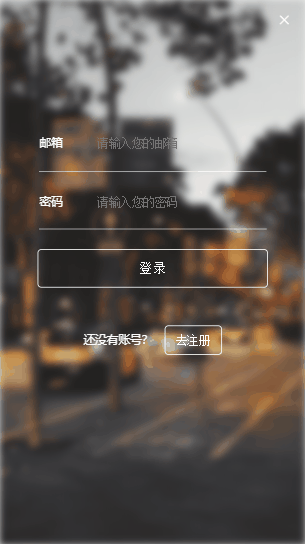

动态页

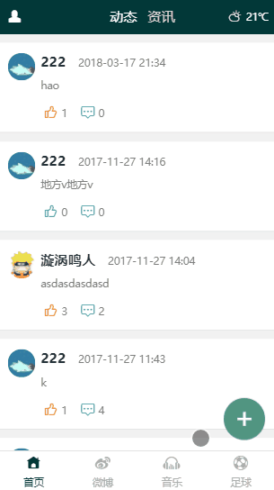

新闻资讯页

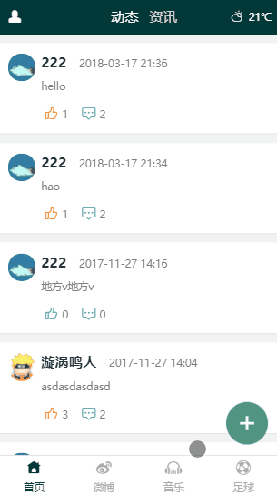

天气页

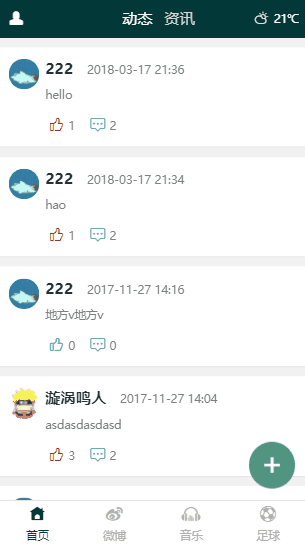

个人资料页

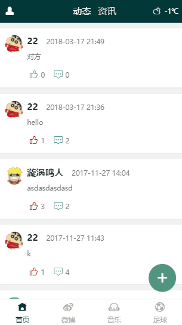

关注好友页

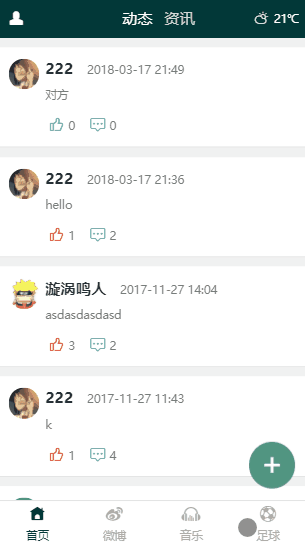

消息列表页

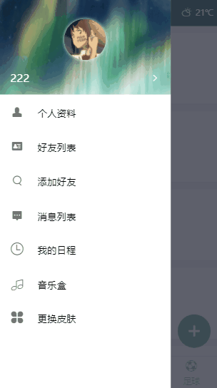

聊天页

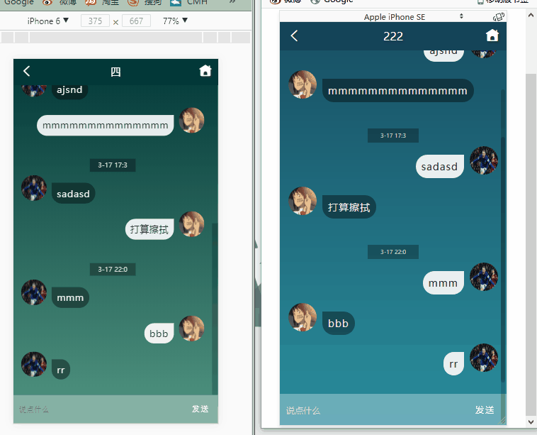

日程页

音乐盒页

更换皮肤页

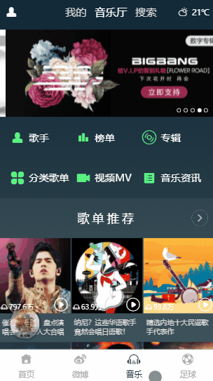

热门微博页

搜索微博页

歌手页

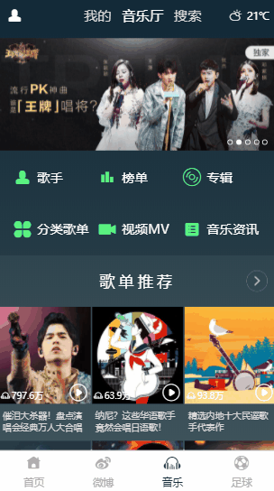

歌单专辑页

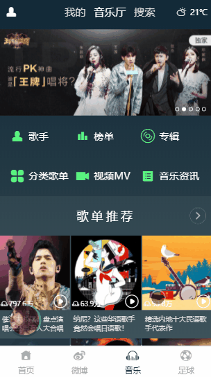

其他音乐页

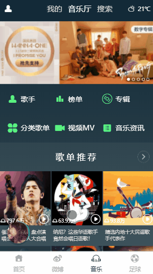

我的音乐页

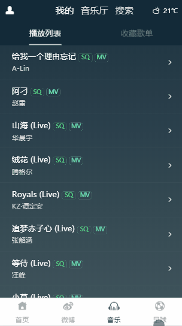

音乐搜索页

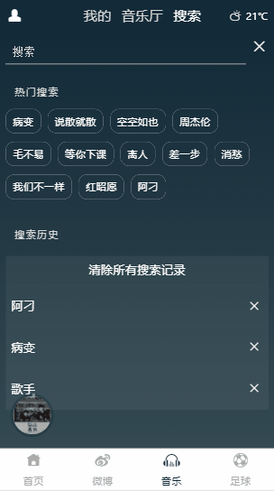

足球新闻页

比赛页

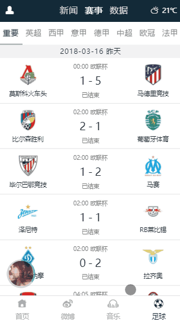

足球数据页

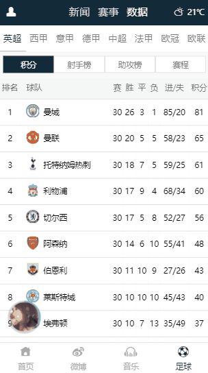
